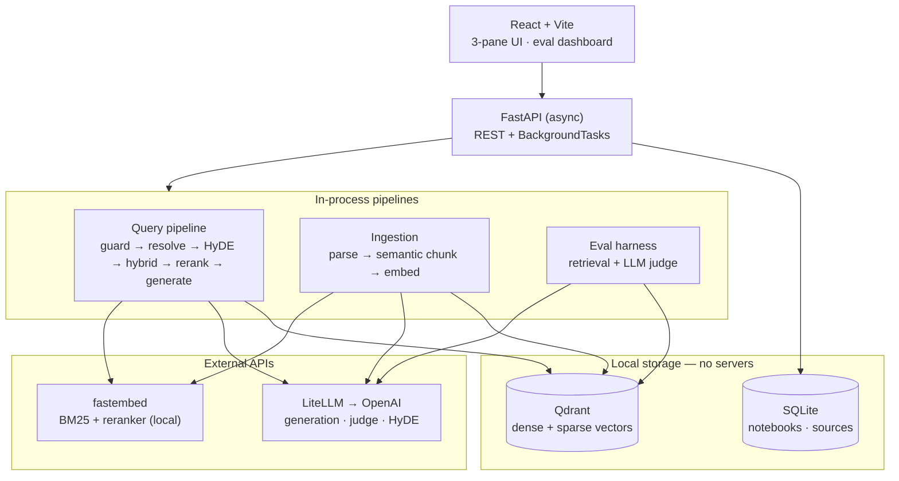
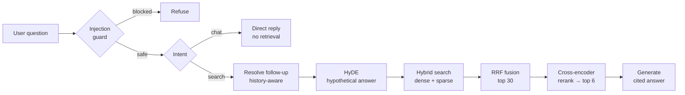
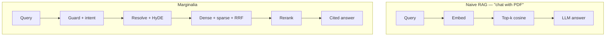

<div align="center">

# Marginalia

### Ask your documents. Get answers you can trace back to the page.

A production-minded **Retrieval-Augmented Generation** system — built to be *measured*, not just demoed.

`FastAPI` · `React` · `Qdrant` · `LiteLLM` · `fastembed` · `SQLite`

</div>

<!--
MEDIA SLOT 1 — LANDING (VIDEO)
Replace <your-username>/<your-repo> below with your actual GitHub path.
File: docs/media/landing.mp4  (commit it to the repo)
GitHub renders <video> tags only with a full raw URL, not a relative path.
-->
<div align="center">


https://github.com/user-attachments/assets/a04c024d-454b-4c3d-97d3-b5e143df722b


</div>

---

## What it is

Marginalia is a RAG application for asking questions over document collections and getting answers with **every source cited**. It ships with two pre-indexed knowledge bases and lets anyone create temporary notebooks from their own PDFs, Markdown, or text.

What makes it different from a typical "chat with PDF" demo: it is **instrumented end to end**. A built-in evaluation harness scores retrieval and answer quality against labelled test sets, and a per-query "retrieval x-ray" makes the internals visible — the resolved query, the hypothetical document, and the exact chunks behind every answer. The goal was never to ship a clever pipeline; it was to ship one whose quality is *demonstrable*.

---

## Demo

<!--
MEDIA SLOT 2 — CHAT + GLASS BOX (VIDEO)
File: docs/media/chat.mp4
-->
<div align="center">


https://github.com/user-attachments/assets/4ba4fa49-e152-48c4-8bd8-c1701730323f

</div>

<p align="center"><em>Every answer is grounded — the x-ray shows exactly which chunks produced it.</em></p>

<!--
MEDIA SLOT 3 — RETRIEVAL EVALS (VIDEO)
File: docs/media/retrieval-evals.mp4
-->
<div align="center">


https://github.com/user-attachments/assets/48929459-5a8c-4ea6-ba5e-7c7fde4354ad


</div>
<p align="center"><em>Retrieval quality, measured live against the full labelled test set.</em></p>

<!--
MEDIA SLOT 4 — ANSWER EVALS (VIDEO)
File: docs/media/answer-evals.mp4
-->
<div align="center">


https://github.com/user-attachments/assets/3094a4bf-a017-4b95-a77e-b9f9e436e924


</div>
<p align="center"><em>Answer quality, judged by an LLM on a stratified per-category sample.</em></p>

---

## Key features

- **Hybrid retrieval** — dense (semantic) + sparse (BM25) search fused with Reciprocal Rank Fusion, so paraphrases *and* exact terms both land.
- **Cross-encoder reranking** — candidates are re-scored against the question for true relevance before they reach the model.
- **HyDE** — generates a hypothetical answer to search with, lifting recall on terse, keyword-poor questions.
- **History-aware follow-ups** — "what is *her* salary?" is rewritten to a standalone question before retrieval, with recency-aware reference resolution.
- **Contextual retrieval** — each chunk is embedded with an LLM-generated one-line context (on the curated knowledge bases).
- **Bring your own documents** — create a notebook and upload up to 10 files (PDF / Markdown / text, 20 MB total); ingestion runs in the background with live status, and the same hybrid-retrieval pipeline answers over them.
- **Prompt-injection guard + intent gate** — malicious inputs are blocked; greetings and meta-questions skip retrieval entirely.
- **Dual evaluation harness** — keyword-based retrieval metrics on the full test set, plus LLM-as-judge answer scoring on a stratified sample, with per-category breakdowns.
- **Retrieval x-ray** — a per-query glass box exposing every step of the pipeline.
- **Model-agnostic** — all LLM calls go through LiteLLM; switch providers by changing one string.

---

## Engineering highlights

Beyond the retrieval techniques, the system is built to behave well under real conditions:

- **Non-blocking background execution.** Ingestion and evaluation runs execute as async `BackgroundTasks`, so uploads return instantly and the 150-question eval never blocks a request — no Celery, no Redis, no extra infrastructure.
- **Live progress via polling.** Eval runs write an incremental `completed / total` counter as each test finishes; the dashboard polls and animates a real-time progress bar — the responsiveness of streaming without the complexity of an SSE channel.
- **Concurrent execution with a thread pool.** Both seeding and evals fan work across an 8-worker `ThreadPoolExecutor`, turning a serial 150-call run into a parallel one while respecting Qdrant's single-writer constraint.
- **Resilience under rate limits.** Every external API call is wrapped in `tenacity` exponential-backoff retries, so transient OpenAI rate-limit blips during a burst are absorbed silently instead of failing a run.
- **Deterministic resource lifecycle.** The Qdrant client is opened once at startup and closed on shutdown via FastAPI's `lifespan`, avoiding the garbage-collector races that plague local-mode clients.
- **Auth-free isolation by design.** A single anonymous `notebook_id` partitions every store (Qdrant payload filter, SQLite rows, lifecycle) — and an hourly TTL sweep wipes anonymous notebooks after 24 hours, bounding storage without a user table.
- **Validated, bounded uploads.** File count, total size, and type are checked client-side before any bytes are sent (fast feedback) and also implemented them in server side, then ingestion runs as a background task with per-source status — so a large upload never blocks the UI and malformed inputs fail early.
- **Provider-agnostic core.** Generation, judging, HyDE, the guard, and the resolver all route through one LiteLLM call site — swapping OpenAI for Anthropic or a local model is a single env change.
- **Evidence-based decisions.** HyDE was kept, the reranker chosen, and chunk counts (retrieve 30 → rerank to 6) all settled by running the eval harness and reading the deltas — not by default.

---

## Architecture

### System overview



Everything runs in a single FastAPI process; Qdrant and SQLite are local files, so there are **no servers to manage**. The query pipeline runs in-request for low latency, while ingestion and evals run as background tasks.

### The query pipeline



### Naive RAG vs. Marginalia



| | Naive RAG | Marginalia |
|---|---|---|
| Retrieval | Dense only | Dense + sparse, RRF-fused |
| Ranking | Cosine top-k | Cross-encoder reranker |
| Query handling | Verbatim | Guard, intent gate, follow-up resolver, HyDE |
| Grounding | Unverified | Inline citations + retrieval x-ray |
| Quality | Assumed | Measured on labelled test sets |

Each added stage exists to fix a specific failure mode of the naive version — and the evaluation harness is what proves the additions actually help.

---

## Evaluation results

Measured against two labelled test sets with distinct difficulty profiles. **Retrieval metrics run on the full set; answer metrics use an LLM judge on a stratified per-category sample.**

> Evals run as non-blocking background jobs across an 8-worker thread pool, with `tenacity` retries absorbing rate-limit bursts and a live `completed / total` counter streamed to the dashboard.

### Knowledge Base 1 — Insurellm (150 questions)

| Retrieval | Score | | Answer (LLM judge, 1–5) | Score |
|---|---|---|---|---|
| Keyword hit rate | **0.975** | | Faithfulness | **4.93** |
| Full coverage | 0.940 | | Correctness | 4.54 |
| MRR | 0.978 | | Relevance | 4.82 |
| nDCG | 0.959 | | | |

### Knowledge Base 2 — Nivara (98 questions)

| Retrieval | Score | | Answer (LLM judge, 1–5) | Score |
|---|---|---|---|---|
| Keyword hit rate | **0.801** | | Faithfulness | **4.54** |
| Full coverage | 0.571 | | Correctness | 4.21 |
| MRR | 0.903 | | Relevance | 4.61 |
| nDCG | 0.920 | | | |

### The interesting part: a per-category gradient

Retrieval quality falls predictably as questions get broader — and that gradient is the honest signal, not a bug:

| Category | KB-1 hit rate | KB-2 hit rate |
|---|---|---|
| direct fact | 1.000 | 0.929 |
| temporal | 1.000 | 1.000 |
| relationship | 0.950 | 0.887 |
| spanning | 0.940 | 0.845 |
| numerical | 1.000 | 0.702 |
| comparative | 1.000 | 0.613 |
| holistic | 0.800 | 0.634 |

Single-fact questions are near-perfect; **holistic** questions (which require synthesizing across many documents) score lowest, because top-*k* chunk retrieval is fundamentally needle-in-haystack, not whole-corpus synthesis. Naming that limit is more useful than hiding it.

> **On HyDE:** it was A/B tested with the harness — on vs. off, across both corpora. The lift was marginal (~1%) and within run-to-run noise, but **consistently non-negative**, so it was kept on rather than adding conditional complexity for no measurable gain. *Measure, then decide.*

---

## Tech stack

| Layer | Choice | Why |
|---|---|---|
| Frontend | React + Vite, Tailwind, Framer Motion | Fast, full design control |
| Backend | FastAPI (async) + BackgroundTasks | Async fits concurrent LLM calls; no queue needed |
| Vector store | Qdrant (local mode) | Native dense + sparse + RRF, no server |
| Metadata | SQLite (SQLModel) | Notebooks, sources, eval runs in one file |
| LLM gateway | LiteLLM | Provider-agnostic — swap models via one string |
| Embeddings | OpenAI `text-embedding-3-small` | 1536-dim, via LiteLLM |
| Sparse + rerank | fastembed | BM25 + ONNX cross-encoder, CPU-only, no key |
| Parsing | PyMuPDF | Robust PDF/text extraction |
| Reliability | tenacity | Exponential-backoff retries on every API call |

---

## Getting started

### Prerequisites

- **Python 3.12** and [**uv**](https://github.com/astral-sh/uv)
- **Node.js 18+**
- An **OpenAI API key**

### 1. Backend

```bash
git clone <your-repo-url> marginalia
cd marginalia

# Install Python dependencies from the lockfile
uv sync

# Create your environment file
cp .env.example .env
# then open .env and paste your OPENAI_API_KEY
```

Your `.env` should look like:

```bash
# Required — one key runs everything
OPENAI_API_KEY=sk-...

# Optional — add a provider, then change LLM_MODEL to use it
ANTHROPIC_API_KEY=

# Models (LiteLLM routes by name)
LLM_MODEL=gpt-4o-mini
EMBEDDING_MODEL=text-embedding-3-small
RERANK_MODEL=Xenova/ms-marco-MiniLM-L-6-v2
SPARSE_MODEL=Qdrant/bm25

# Local storage
QDRANT_PATH=./data/qdrant
DB_PATH=./data/app.db

# Lifecycle & limits
NOTEBOOK_TTL_HOURS=24
MAX_UPLOAD_MB=20
MAX_FILES=10
ENABLE_CONTEXTUAL=true
```
**Create the local data directory (gitignored — holds Qdrant + SQLite)**

```bash
mkdir -p data
```

**Seed the default knowledge bases** (one time, with the server *stopped* — Qdrant's local mode is single-writer):

```bash
uv run python backend/seed.py
```

**Run the API:**

```bash
uv run run.py
```

The backend serves at `http://localhost:8000` — interactive docs at `http://localhost:8000/docs`.

### 2. Frontend

In a second terminal:

```bash
cd frontend
npm install
npm run dev
```

Open `http://localhost:5173`.

---

## Project structure

```
marginalia/
├── backend/
│   ├── main.py            # FastAPI app, CORS, startup, 24h TTL sweep
│   ├── config.py          # all settings from .env
│   ├── clients.py         # Qdrant, fastembed, LiteLLM + retries
│   ├── database.py        # SQLModel tables
│   ├── seed.py            # one-time default-KB ingestion
│   ├── routers/           # notebooks · sources · chat · evals
│   ├── pipeline/          # chunking · ingestion · retrieval · guard · resolver · generation · orchestrator
│   └── evaluation/        # metrics · harness
├── frontend/              # React + Vite app
├── kb/                    # default knowledge bases + test sets
├── run.py                 # uv run run.py
└── pyproject.toml
```

---

## Design decisions & trade-offs

- **No authentication.** Notebooks are isolated by an anonymous `notebook_id` (UUID) kept in the browser and used as a partition key across every store. Auth would add a login flow with zero portfolio payoff; isolation and cleanup were what actually mattered, and a partition key delivers both.
- **Single-process Qdrant (local mode).** Zero infrastructure to run, at the cost of single-writer access — which is why seeding requires the server stopped. Swapping to a Qdrant server is a one-line change in `clients.py`.
- **Contextual retrieval on default KBs only.** It's a quality win but adds an LLM call per chunk, so user uploads skip it to keep ingestion fast.
- **HyDE kept after measurement, not by default faith.** See the evaluation note above.

---

## Limitations & roadmap

Named deliberately — these are the honest edges of a v1.

- **No global summarization.** "Summarize all the documents" is a known weak spot; chunk retrieval can't synthesize a whole corpus. A v2 would add hierarchical or graph-based summaries.
- **No persistent auth or multi-device access.** Identity lives in the browser; clearing storage loses your notebooks. Anonymous notebooks are wiped after 24 hours.
- **Lightweight reranker.** `MiniLM` is fast and CPU-friendly; a heavier reranker (`bge-reranker-v2-m3`) would likely lift the weaker categories — swappable via one config string and verifiable with the existing harness.
- **CORS scoping, not API security.** Origin-restricted for the browser; not a substitute for authentication on a public deployment.

---

<div align="center">
<sub>Built as a portfolio project to demonstrate applied RAG engineering — hybrid retrieval, evaluation, and honest measurement over hype.</sub>
</div>